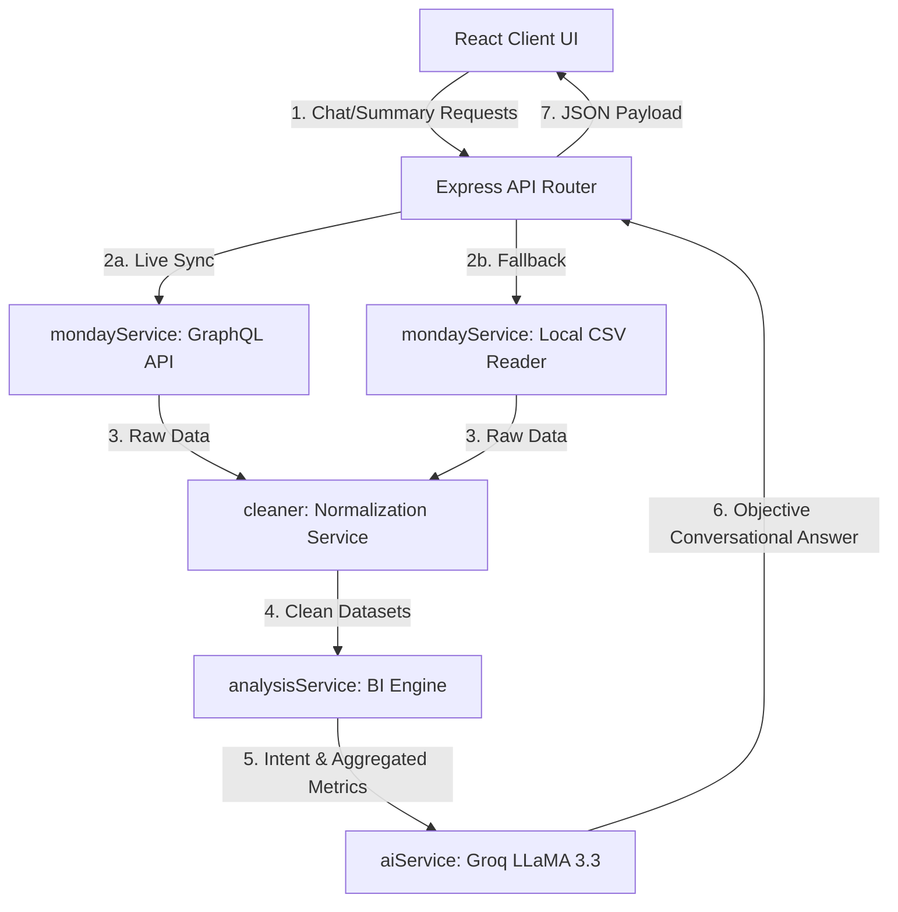

# Skylark Drones - Business Intelligence AI Agent

A full-stack Business Intelligence (BI) agent that compiles and analyzes founder-level metrics across Monday.com CRM boards. It provides live insights on sales pipelines, revenue collections, operational timelines, and risk mitigation.

---

## 🚀 Key Features

*   **Executive Intelligence Dashboard:** Real-time summary cards for Active Pipeline, Billed Revenue, Delayed Projects, and Cash Collections.
*   **Natural Language Querying:** Conversational AI query endpoint powered by Groq SDK (LLaMA 3.3 70B model).
*   **Interactive Notion/Linear-Style Reports:** Generates structured markdown tables inside chat bubbles with automatic status badge formatting (e.g., green for won, red for delayed).
*   **Resilient Fallback Layer:** Gracefully falls back to local dataset parsing if the Monday.com GraphQL API becomes unreachable.

---

## 🛠️ Tech Stack

*   **Frontend:** React (Vite), Tailwind CSS, Lucide Icons, PostCSS.
*   **Backend:** Node.js, Express, Groq SDK, Axios, CSV-Parse.
*   **Integrations:** Monday.com GraphQL API.

---

## 🏗️ System Architecture & Data Flow

The project is built on a decoupled Client-Server architecture utilizing a services-oriented pattern on the backend to cleanly separate data retrieval, normalization, business logic, and AI response synthesis.

### Architectural Diagram


### Components & Services Boundaries

1.  **Frontend Interface (Client)**
    *   **Orchestrator (`App.jsx`):** Houses theme preferences, holds active conversation state, and performs data-fetching triggers.
    *   **Components:**
        *   `Header.jsx` & `KpiBar.jsx`: Sticky navigation controls and visual dashboard summary cards.
        *   `Chat.jsx` & `Message.jsx`: Dynamic messaging templates featuring regex-based Notion/Linear markdown parsing for tables and colored status badges.

2.  **Backend Services (Server)**
    *   **API Controller (`routes/chat.js`):** Orchestrates API routes, manages pipeline flow from data loading to AI response creation, and provides HTTP error handling.
    *   **Database Sync (`services/mondayService.js`):** Queries remote GraphQL boards. Implements an automatic file-system fallback to load local `.csv` datasets if API credentials are not provided or if the connection fails.
    *   **Normalization Layer (`services/cleaner.js`):** Sanitizes and formats currency to INR (Lakhs/Crores), handles date parsing, checks edge cases, and maps Monday.com objects into normalized JS payloads.
    *   **BI Analysis Engine (`services/analysisService.js`):** Calculates key business KPIs (Active Pipeline, Billed Revenue, Delayed Projects, Collected Cash), groups records by industry sectors, and extracts user query intents.
    *   **AI Synthesis (`services/aiService.js`):** Compiles the clean metrics and intents into a low-temperature system prompt, calling the Groq SDK to construct concise, professional business intelligence updates.

---

## 📂 Project Structure

```text
Skylark-Drones-Assessment/
├── client/                 # React Frontend Application
│   ├── src/
│   │   ├── components/     # Chat, KpiBar, Header, InputBox, Message
│   │   ├── App.jsx         # App state & API orchestrator
│   │   └── index.css       # Animations & design system tokens
│   └── package.json
└── server/                 # Express Backend Service
    ├── data/               # Local CSV fallback datasets (ignored from git)
    ├── routes/             # API routes (/api/chat, /api/summary)
    ├── services/           # Monday.com API, AI, Cleaner, and BI analysis services
    ├── app.js              # Express main entry point
    └── package.json
```

---

## ⚙️ Setup & Installation

### 1. Prerequisites
Ensure you have [Node.js](https://nodejs.org/) installed (v18+ recommended).

### 2. Environment Configuration
Create a `.env` file in the `/server` directory:
```env
PORT=5000
GROQ_API_KEY=your_groq_api_key
MONDAY_API_KEY=your_monday_api_key
DEALS_BOARD_ID=your_deals_board_id
WORK_ORDERS_BOARD_ID=your_work_orders_board_id
```

### 3. Run Backend Server
```bash
cd server
npm install
npm run dev      # Starts API on http://localhost:5000
```

### 4. Run Frontend Client
```bash
cd client
npm install
npm run dev      # Starts dev server on http://localhost:3000
```

---

## 🔌 API Documentation

*   **`GET /health`**
    *   Health check endpoint.
*   **`GET /api/summary`**
    *   Compiles and returns the company's core KPIs for the dashboard cards.
*   **`POST /api/chat`**
    *   Processes executive business intelligence queries.
    *   **Body:** `{ "message": "query string" }`
